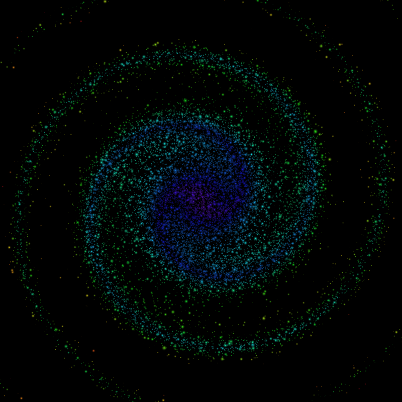
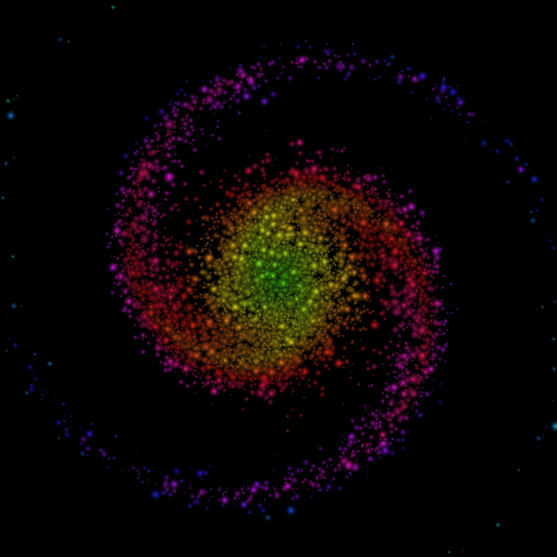
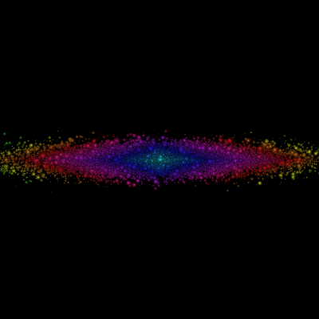

# ProcGalaxy
Procedural Colorful Galaxies






[ Procedural Planets see below](#procplanets)

[Download ProcGalaxy here!](https://github.com/dattasid/ProcGalaxy/raw/master/binaries/prettygalaxy.v1.jar)

Double click the jar to get a random galaxy shown. (Window closes automatically after 20 seconds).

To save images or control the generation process, you will have to get down to the command line.

```
java -jar prettygalaxy.v1.jar [options...]
 -imageSize N      : Output image size. Images are always square. Default is
                     800x800.
 -out dir/prefix   : Output file. Finds the first unused file dir/prefixN and
                     writes to it. Can write -numRuns number of files
                     incrementally numbered. Directory must be provided and
                     must already exist.
                      If absent, shows one image and exits.
 -numRuns N        : Produce how many images. Without an -out option, shows 1
                     image and quits.
 -numStarsInThou N : Number of stars in thousands.Default 20k.
 -numArms N        : Number of arms of the galaxy. Default random between 2-6.
 -maxArms N        : Maximum number of randomly chosen arms. Minimum is always
                     2. If -numArms is specified, that value is always used.
                     Default 6.
 -swirl N          : Angular spread, in multiples of Pi. Default random  -3.0 to
                     -1.0 or +1.0 to +3.0.
 -armsWeight N     : Low values keep stars close to disk, high values push them
                     out to the arms. Default .1 to .4.
 -armsThickness N  : Low values make thinner arms, high values make thicker
                     arms and bigger central disk. Default values .05 to .15.
 -avgStarRad N     : Average star radius in pixels. Default 2.5. Star radius is
                     chosen on a gaussian distribution.
 -maxStarRad N     : Maximum star radius in pixels allowed. Default 10.
 -hueStart N       : Color of the center of the galaxy. Range 0.0 to 1.0.
 -hueChangeLong N  : Rate of color change center towards arms. Default random
                     -2.0 to 2.0
 -hueChangeTrans N : Rate of color change from center of arms towards sides.
                     Default -0.2 + +0.2 Default random -1.0 to 1.0
```
Example: ```java -jar prettygalaxy.v1.jar -numStarsInThou 40  -numRuns 1 -out out/lgim -armsThickness .5 -imageSize 1500```

The program first creates stars in a bar or a star shape. Then a swirl is put on it (rotate the star around the galactic center proportional to how far it is from there.)

This is how it looks before the swirl:




#procplanets


[Download ProcPlanets here!](https://github.com/dattasid/ProcGalaxy/raw/master/binaries/PlanetGfx.v1.jar)

Procedural planets. Currently three types are implemented.

+ Habitable planets with landmasses, water oceans and cloud cover.
+ Gas  (Storm) planets.
+ Cracked (lava) planets with glowing magma visible even on the dark side.
 
```
java -jar PlanetGfx.v1.jar [options...]
 -imageSize N    : Output image size. Images are always square. Default is
                   800x800.
 -out dir/prefix : Output file. Finds the first unused file dir/prefixN and
                   writes to it. Can write -numRuns number of files
                   incrementally numbered. Directory must be provided and must
                   already exist.
                    If absent, shows one image and exits.
 -numRuns N      : Produce how many images. Without an -out option, shows 1
                   image and quits.
 -types VAL      : What types of planet. Comma separated list of types. valid
                   values are lava, habitable and storm.
                   Example: --types lava,habitable
 -layout VAL     : single, grid or line. Single just creates one planet, grid
                   creates a 5x5 grid of randomly picked planets. Line creates
                   planets in a line for showcasing.
 -clearback      : Transparent background, so it is easy to compose into other
                   images
```

Example: ```java -jar PlanetGfx.v1.jar -numRuns 1 -types habitable,storm -out out/lgim -layout single```

